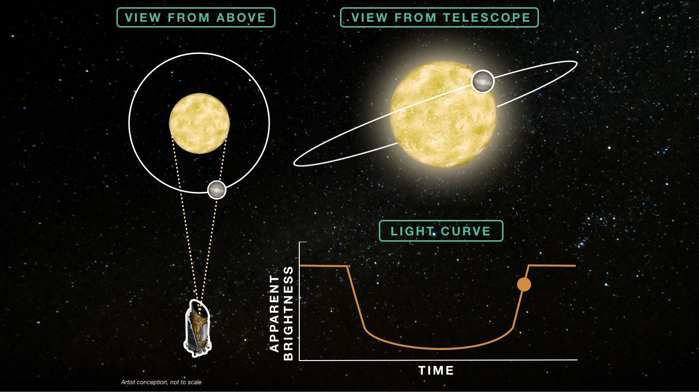

# 🌍 ECHO LENS

[](https://www.python.org/downloads/)
[](https://opensource.org/licenses/MIT)
[](https://streamlit.io)

**Machine Learning Tool for Exoplanet Hunting**

NASA Space Apps Challenge 2025 - Challenge 2 - A World Away: Hunting for Exoplanets with AI

## Table of Contents
- [Overview](#overview)
- [The Challenge: Hunting for Exoplanets](#the-challenge-hunting-for-exoplanets)
- [Technical Implementation](#technical-implementation)
- [Features](#features)
- [Prerequisites](#prerequisites)
- [Installation](#installation)
- [Usage](#usage)
- [Project Structure](#project-structure)
- [Technologies](#technologies)
- [Educational Value](#educational-value)
- [Limitations](#limitations)
- [Contributing](#contributing)
- [Future Enhancements](#future-enhancements)
- [Data Sources](#data-sources)
- [Acknowledgments](#acknowledgments)
- [License](#license)




---

## Overview

ECHO LENS is an educational web application that uses machine learning to classify exoplanet candidates from NASA's Kepler mission data. Built with accessibility in mind, it allows students, educators, and space enthusiasts to explore real exoplanet data through an intuitive interface.

---

## The Challenge: Hunting for Exoplanets

The NASA Space Apps Challenge 2025 presented us with the task of developing AI tools to aid in the discovery of exoplanets. The primary challenge lies in analyzing vast amounts of stellar data to identify potential exoplanets among thousands of candidates.

### Available Detection Methods

1. **Transit Method** (Our Focus)
   - Detects planets by measuring periodic dimming of starlight
   - Provides data on planet size and orbital period
   - Primary method used by Kepler mission
   - Challenges: False positives from binary stars, stellar variations

2. **Radial Velocity Method**
   - Measures star's wobble due to planetary gravitational pull
   - Provides data on planet mass
   - Complementary to transit method
   - Limitations: Requires high-precision spectroscopy

3. **Direct Imaging**
   - Attempts to visually observe planets
   - Best for young, bright planets far from their stars
   - Limited by current technology

### Our Approach: Machine Learning with KOI Data

We chose to focus on analyzing the Kepler Objects of Interest (KOI) data for several reasons:

1. **Preprocessed Data**: KOI data provides already processed transit parameters, making it more accessible for educational purposes
2. **Rich Feature Set**: Each KOI entry includes key orbital parameters and transit characteristics
3. **Educational Value**: Working with KOI data helps understand the key parameters that identify exoplanets
4. **AI Potential**: Machine learning can effectively classify KOI candidates using their orbital parameters

### Why Random Forest Classification?

Our solution employs a Random Forest Classifier because:

1. **Interpretability**: Unlike "black box" deep learning models, Random Forests provide clear feature importance rankings
2. **Robustness**: Handles both numerical and categorical data well, resistant to outliers
3. **Performance**: Achieves 90% accuracy without requiring extensive computational resources
4. **Educational Merit**: Helps users understand which planetary parameters are most significant

---

## Technical Implementation

### Data
- **Source**: NASA Kepler Cumulative KOI (Kepler Objects of Interest) Table
- **Features**: 11 orbital parameters including period, transit depth, duration, planetary radius, and equilibrium temperature
- **Split**: 80% training, 20% testing
- **Preprocessing**: StandardScaler normalization, missing value handling

### Model
- **Algorithm**: Random Forest Classifier (scikit-learn)
- **Performance**: 90% accuracy on test set
- **Training**: Supervised learning on labeled historical KOI data
- **Output**: Binary classification (exoplanet candidate vs. false positive) with confidence score

### Interface
- **Framework**: Streamlit
- **Design**: Web-based, no installation required for end users
- **Focus**: Educational experience with pre-loaded examples

---

## Features

- **Pre-loaded Examples**: Explore famous exoplanets including Kepler-10b and the Kepler-90 system
- **Interactive Classification**: See real-time predictions with confidence scores
- **Feature Importance**: Understand which orbital parameters drive classification decisions
- **Educational Context**: Learn about each exoplanet's discovery and characteristics
- **Accessible Design**: No prior astronomy or coding knowledge required

---

## Installation
```bash
# Clone repository
git clone https://github.com/Sun2301/exoplanet_hunt
cd exoplanet_hunt

# Install dependencies
pip install -r requirements.txt


```

## Usage

1. **Launch Application**
   ```bash
    - 
   

2. **Explore Examples**
   - Select from pre-loaded examples in the dropdown
   - View detailed information about each KOI
   - See visualizations of orbital parameters

3. **Make Predictions**
   - Click "Classify" to run the model
   - Review confidence scores
   - Explore feature importance analysis

4. **Learn More**
   - Read educational content about each parameter
   - Understand the classification process
   - Compare different exoplanet candidates


## Technologies

| Category | Technologies Used |
|----------|------------------|
| Core | Python 3.9+ |
| Machine Learning | scikit-learn (Random Forest) |
| Data Processing | Pandas, NumPy |
| Web Interface | Streamlit |
| Visualization | Matplotlib, Plotly |
| Version Control | Git |

## ## Educational Value

This tool is designed for novices in exoplanet science. Users learn:

### Astronomical Concepts
- Understanding orbital parameters and their significance
- Interpreting transit data and light curves
- Distinguishing between different types of celestial objects

### Data Science Skills
- Machine learning application in astronomy
- Feature importance and model interpretation
- Data preprocessing and validation

### Real-World Applications
- Hands-on experience with NASA Kepler mission data
- Understanding the exoplanet confirmation process
- Exploration of real confirmed exoplanets


Limitations

- **Data Scope**: Works with KOI (Kepler Objects of Interest) data only
- **Pre-processing**: Cannot process raw transit data or light curves
- **Input Format**: Limited to pre-loaded examples with specific KOI parameters
- **Historical Data**: Model trained on past Kepler mission KOI data only


## Contributing

We welcome contributions to ECHO LENS! Here's how you can help:

1. **Bug Reports**
   - Use the Issues tab to report bugs
   - Include steps to reproduce the issue
   - Specify your environment details

2. **Feature Requests**
   - Submit feature requests via Issues
   - Explain the use case
   - Provide examples if possible

3. **Code Contributions**
   - Fork the repository
   - Create a feature branch
   - Submit a Pull Request
   - Follow our coding standards

## Future Enhancements

- **User Functionality**
  - Custom data upload capability
  - Batch classification processing
  - User accounts and saved results

- **Technical Features**
  - Light curve visualization tools
  - Integration with other detection methods
  - Deep learning model comparison
  - API endpoint for programmatic access

- **Educational Content**
  - Interactive tutorials
  - Expanded exoplanet database
  - Multi-language support

## Data Sources

- [NASA Exoplanet Archive](https://exoplanetarchive.ipac.caltech.edu/)
- [Kepler Mission Overview](https://www.nasa.gov/mission_pages/kepler/overview/index.html)
- [Kepler KOI Documentation](https://exoplanetarchive.ipac.caltech.edu/docs/API_kepcandidate_columns.html)

## Acknowledgments
This project was developed for the NASA Space Apps Challenge 2025. We thank NASA for providing open access to exoplanet data and the Space Apps Challenge organizers for this learning opportunity.

## License

Copyright (c) 2025 ECHO LENS Team

This project is licensed under the MIT License - see the [LICENSE](LICENSE) file for details.